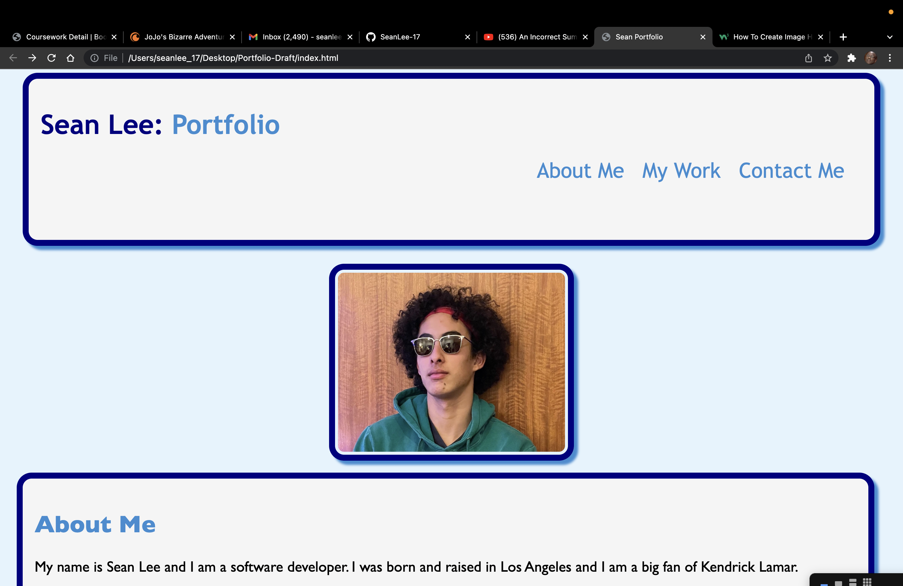

# Portfolio-Draft

## Description 

This is my profeesional portfolio. In it you can find information about me, samples of my work, and my contact information. You can also find a picture of me attached to this website. I utilized both HTML and CSS to style and manipulate the information on the screen. This portfolio also displays all the work we have completed in this course.

## "My empire of dirt" -Johnny Cash

This portfolio displays all the course work I have completed so far in my course. This includes a CSS and HTML rework, a responsive password generator, a coding quiz with multiple questions, a daily planner with accurate time indicator, and a reactive music encyclopedia that can store user information. ALL of these projects were created through VS Code and GitHub.

## Languages

- HTML
- CSS

## Links

- [Github Repository](https://github.com/SeanLee-17/Portfolio-Draft)
- [Website](https://seanlee-17.github.io/Portfolio-Draft/)

## Screenshot

